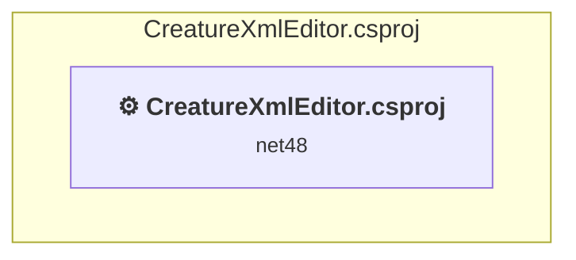

# Projects and dependencies analysis

This document provides a comprehensive overview of the projects and their dependencies in the context of upgrading to .NETCoreApp,Version=v10.0.

## Table of Contents

- [Executive Summary](#executive-Summary)
  - [Highlevel Metrics](#highlevel-metrics)
  - [Projects Compatibility](#projects-compatibility)
  - [Package Compatibility](#package-compatibility)
  - [API Compatibility](#api-compatibility)
- [Aggregate NuGet packages details](#aggregate-nuget-packages-details)
- [Top API Migration Challenges](#top-api-migration-challenges)
  - [Technologies and Features](#technologies-and-features)
  - [Most Frequent API Issues](#most-frequent-api-issues)
- [Projects Relationship Graph](#projects-relationship-graph)
- [Project Details](#project-details)

  - [CreatureXmlEditor.csproj](#creaturexmleditorcsproj)

## Executive Summary

### Highlevel Metrics

| Metric | Count | Status |
| :--- | :---: | :--- |
| Total Projects | 1 | All require upgrade |
| Total NuGet Packages | 10 | All compatible |
| Total Code Files | 16 |  |
| Total Code Files with Incidents | 6 |  |
| Total Lines of Code | 2404 |  |
| Total Number of Issues | 2500 |  |
| Estimated LOC to modify | 2493+ | at least 103.7% of codebase |

### Projects Compatibility

| Project | Target Framework | Difficulty | Package Issues | API Issues | Est. LOC Impact | Description |
| :--- | :---: | :---: | :---: | :---: | :---: | :--- |
| [CreatureXmlEditor.csproj](#creaturexmleditorcsproj) | net48 | 🟡 Medium | 5 | 2493 | 2493+ | ClassicWinForms, Sdk Style = False |

### Package Compatibility

| Status | Count | Percentage |
| :--- | :---: | :---: |
| ✅ Compatible | 10 | 100.0% |
| ⚠️ Incompatible | 0 | 0.0% |
| 🔄 Upgrade Recommended | 0 | 0.0% |
| ***Total NuGet Packages*** | ***10*** | ***100%*** |

### API Compatibility

| Category | Count | Impact |
| :--- | :---: | :--- |
| 🔴 Binary Incompatible | 2438 | High - Require code changes |
| 🟡 Source Incompatible | 52 | Medium - Needs re-compilation and potential conflicting API error fixing |
| 🔵 Behavioral change | 3 | Low - Behavioral changes that may require testing at runtime |
| ✅ Compatible | 2146 |  |
| ***Total APIs Analyzed*** | ***4639*** |  |

## Aggregate NuGet packages details

| Package | Current Version | Suggested Version | Projects | Description |
| :--- | :---: | :---: | :--- | :--- |
| Microsoft.Bcl.AsyncInterfaces | 10.0.3 |  | [CreatureXmlEditor.csproj](#creaturexmleditorcsproj) | ✅Compatible |
| System.Buffers | 4.6.1 |  | [CreatureXmlEditor.csproj](#creaturexmleditorcsproj) | NuGet package functionality is included with framework reference |
| System.IO.Pipelines | 10.0.3 |  | [CreatureXmlEditor.csproj](#creaturexmleditorcsproj) | ✅Compatible |
| System.Memory | 4.6.3 |  | [CreatureXmlEditor.csproj](#creaturexmleditorcsproj) | NuGet package functionality is included with framework reference |
| System.Numerics.Vectors | 4.6.1 |  | [CreatureXmlEditor.csproj](#creaturexmleditorcsproj) | NuGet package functionality is included with framework reference |
| System.Runtime.CompilerServices.Unsafe | 6.1.2 |  | [CreatureXmlEditor.csproj](#creaturexmleditorcsproj) | ✅Compatible |
| System.Text.Encodings.Web | 10.0.3 |  | [CreatureXmlEditor.csproj](#creaturexmleditorcsproj) | ✅Compatible |
| System.Text.Json | 10.0.3 |  | [CreatureXmlEditor.csproj](#creaturexmleditorcsproj) | ✅Compatible |
| System.Threading.Tasks.Extensions | 4.6.3 |  | [CreatureXmlEditor.csproj](#creaturexmleditorcsproj) | NuGet package functionality is included with framework reference |
| System.ValueTuple | 4.6.1 |  | [CreatureXmlEditor.csproj](#creaturexmleditorcsproj) | NuGet package functionality is included with framework reference |

## Top API Migration Challenges

### Technologies and Features

| Technology | Issues | Percentage | Migration Path |
| :--- | :---: | :---: | :--- |
| Windows Forms | 2438 | 97.8% | Windows Forms APIs for building Windows desktop applications with traditional Forms-based UI that are available in .NET on Windows. Enable Windows Desktop support: Option 1 (Recommended): Target net9.0-windows; Option 2: Add <UseWindowsDesktop>true</UseWindowsDesktop>; Option 3 (Legacy): Use Microsoft.NET.Sdk.WindowsDesktop SDK. |
| Windows Forms Legacy Controls | 64 | 2.6% | Legacy Windows Forms controls that have been removed from .NET Core/5+ including StatusBar, DataGrid, ContextMenu, MainMenu, MenuItem, and ToolBar. These controls were replaced by more modern alternatives. Use ToolStrip, MenuStrip, ContextMenuStrip, and DataGridView instead. |
| GDI+ / System.Drawing | 52 | 2.1% | System.Drawing APIs for 2D graphics, imaging, and printing that are available via NuGet package System.Drawing.Common. Note: Not recommended for server scenarios due to Windows dependencies; consider cross-platform alternatives like SkiaSharp or ImageSharp for new code. |

### Most Frequent API Issues

| API | Count | Percentage | Category |
| :--- | :---: | :---: | :--- |
| T:System.Windows.Forms.Label | 211 | 8.5% | Binary Incompatible |
| T:System.Windows.Forms.NumericUpDown | 198 | 7.9% | Binary Incompatible |
| T:System.Windows.Forms.TextBox | 123 | 4.9% | Binary Incompatible |
| T:System.Windows.Forms.Button | 103 | 4.1% | Binary Incompatible |
| T:System.Windows.Forms.TabPage | 97 | 3.9% | Binary Incompatible |
| T:System.Windows.Forms.AnchorStyles | 93 | 3.7% | Binary Incompatible |
| T:System.Windows.Forms.GroupBox | 92 | 3.7% | Binary Incompatible |
| T:System.Windows.Forms.ListBox | 76 | 3.0% | Binary Incompatible |
| P:System.Windows.Forms.Control.Name | 68 | 2.7% | Binary Incompatible |
| P:System.Windows.Forms.Control.Size | 67 | 2.7% | Binary Incompatible |
| T:System.Windows.Forms.Control.ControlCollection | 66 | 2.6% | Binary Incompatible |
| P:System.Windows.Forms.Control.Controls | 66 | 2.6% | Binary Incompatible |
| M:System.Windows.Forms.Control.ControlCollection.Add(System.Windows.Forms.Control) | 66 | 2.6% | Binary Incompatible |
| P:System.Windows.Forms.Control.Location | 62 | 2.5% | Binary Incompatible |
| P:System.Windows.Forms.Control.TabIndex | 61 | 2.4% | Binary Incompatible |
| T:System.Windows.Forms.ComboBox | 45 | 1.8% | Binary Incompatible |
| P:System.Windows.Forms.NumericUpDown.Value | 40 | 1.6% | Binary Incompatible |
| T:System.Windows.Forms.HorizontalAlignment | 39 | 1.6% | Binary Incompatible |
| T:System.Windows.Forms.TabControl | 38 | 1.5% | Binary Incompatible |
| T:System.Windows.Forms.MenuItem | 35 | 1.4% | Binary Incompatible |
| T:System.Windows.Forms.MessageBoxIcon | 32 | 1.3% | Binary Incompatible |
| T:System.Windows.Forms.MessageBoxButtons | 32 | 1.3% | Binary Incompatible |
| T:System.Windows.Forms.DialogResult | 30 | 1.2% | Binary Incompatible |
| P:System.Windows.Forms.TextBox.Text | 28 | 1.1% | Binary Incompatible |
| P:System.Windows.Forms.ListBox.SelectedIndex | 22 | 0.9% | Binary Incompatible |
| P:System.Windows.Forms.Label.Text | 21 | 0.8% | Binary Incompatible |
| P:System.Windows.Forms.Label.AutoSize | 21 | 0.8% | Binary Incompatible |
| M:System.Windows.Forms.Label.#ctor | 21 | 0.8% | Binary Incompatible |
| P:System.Windows.Forms.ButtonBase.Text | 20 | 0.8% | Binary Incompatible |
| T:System.Windows.Forms.MessageBox | 16 | 0.6% | Binary Incompatible |
| M:System.Windows.Forms.MessageBox.Show(System.String,System.String,System.Windows.Forms.MessageBoxButtons,System.Windows.Forms.MessageBoxIcon) | 16 | 0.6% | Binary Incompatible |
| T:System.Windows.Forms.PictureBox | 15 | 0.6% | Binary Incompatible |
| F:System.Windows.Forms.MessageBoxButtons.OK | 13 | 0.5% | Binary Incompatible |
| F:System.Windows.Forms.HorizontalAlignment.Center | 13 | 0.5% | Binary Incompatible |
| F:System.Windows.Forms.AnchorStyles.Right | 13 | 0.5% | Binary Incompatible |
| P:System.Windows.Forms.Control.Anchor | 13 | 0.5% | Binary Incompatible |
| P:System.Windows.Forms.UpDownBase.TextAlign | 12 | 0.5% | Binary Incompatible |
| M:System.Windows.Forms.NumericUpDown.#ctor | 12 | 0.5% | Binary Incompatible |
| M:System.Windows.Forms.Control.ResumeLayout(System.Boolean) | 11 | 0.4% | Binary Incompatible |
| F:System.Windows.Forms.AnchorStyles.Top | 11 | 0.4% | Binary Incompatible |
| M:System.Windows.Forms.Control.SuspendLayout | 11 | 0.4% | Binary Incompatible |
| P:System.Windows.Forms.ComboBox.Text | 10 | 0.4% | Binary Incompatible |
| T:System.Windows.Forms.ToolTip | 9 | 0.4% | Binary Incompatible |
| E:System.Windows.Forms.Control.Click | 9 | 0.4% | Binary Incompatible |
| P:System.Windows.Forms.NumericUpDown.Minimum | 9 | 0.4% | Binary Incompatible |
| P:System.Windows.Forms.NumericUpDown.Maximum | 9 | 0.4% | Binary Incompatible |
| P:System.Windows.Forms.Control.Visible | 8 | 0.3% | Binary Incompatible |
| T:System.Windows.Forms.ListBox.ObjectCollection | 8 | 0.3% | Binary Incompatible |
| P:System.Windows.Forms.ListBox.Items | 8 | 0.3% | Binary Incompatible |
| M:System.Windows.Forms.Control.PerformLayout | 8 | 0.3% | Binary Incompatible |

## Projects Relationship Graph

Legend:
📦 SDK-style project
⚙️ Classic project

## Project Details

### CreatureXmlEditor.csproj

#### Project Info

- **Current Target Framework:** net48
- **Proposed Target Framework:** net10.0-windows
- **SDK-style**: False
- **Project Kind:** ClassicWinForms
- **Dependencies**: 0
- **Dependants**: 0
- **Number of Files**: 20
- **Number of Files with Incidents**: 6
- **Lines of Code**: 2404
- **Estimated LOC to modify**: 2493+ (at least 103.7% of the project)

#### Dependency Graph

Legend:
📦 SDK-style project
⚙️ Classic project

### API Compatibility

| Category | Count | Impact |
| :--- | :---: | :--- |
| 🔴 Binary Incompatible | 2438 | High - Require code changes |
| 🟡 Source Incompatible | 52 | Medium - Needs re-compilation and potential conflicting API error fixing |
| 🔵 Behavioral change | 3 | Low - Behavioral changes that may require testing at runtime |
| ✅ Compatible | 2146 |  |
| ***Total APIs Analyzed*** | ***4639*** |  |

#### Project Technologies and Features

| Technology | Issues | Percentage | Migration Path |
| :--- | :---: | :---: | :--- |
| GDI+ / System.Drawing | 52 | 2.1% | System.Drawing APIs for 2D graphics, imaging, and printing that are available via NuGet package System.Drawing.Common. Note: Not recommended for server scenarios due to Windows dependencies; consider cross-platform alternatives like SkiaSharp or ImageSharp for new code. |
| Windows Forms Legacy Controls | 64 | 2.6% | Legacy Windows Forms controls that have been removed from .NET Core/5+ including StatusBar, DataGrid, ContextMenu, MainMenu, MenuItem, and ToolBar. These controls were replaced by more modern alternatives. Use ToolStrip, MenuStrip, ContextMenuStrip, and DataGridView instead. |
| Windows Forms | 2438 | 97.8% | Windows Forms APIs for building Windows desktop applications with traditional Forms-based UI that are available in .NET on Windows. Enable Windows Desktop support: Option 1 (Recommended): Target net9.0-windows; Option 2: Add <UseWindowsDesktop>true</UseWindowsDesktop>; Option 3 (Legacy): Use Microsoft.NET.Sdk.WindowsDesktop SDK. |

